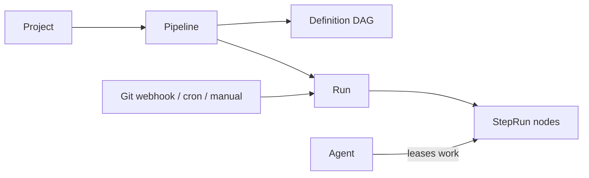
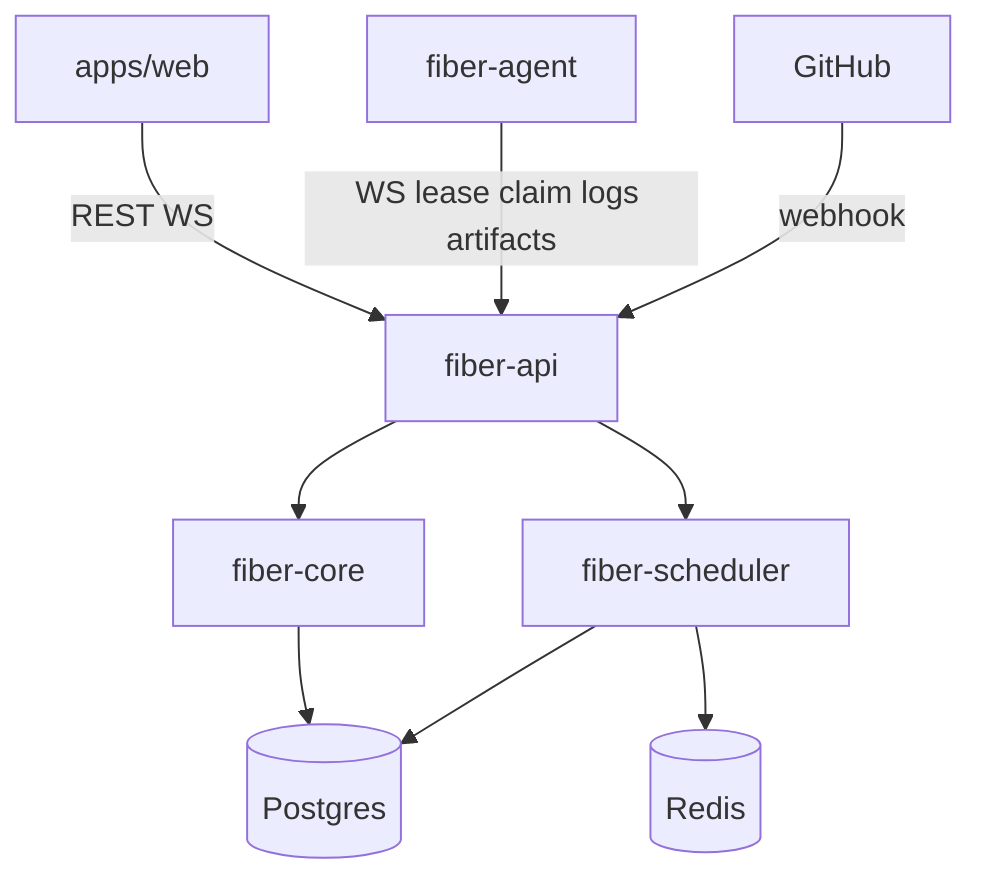

# Durable Fibers — Self-Hosted DAG CI Platform (MVP)

## Product thesis

**Durable Fibers** is a self-hosted automation server: define pipelines as DAGs, edit them visually, run them on your agents, stream logs and artifacts. UI/IA borrows Railway’s calm project-centric navigation; feature bar is Jenkins-class CI (not Northflank PaaS). Deploy/runtime hosting is explicitly out of scope for MVP.

## Stack (locked)

| Layer | Choice |
|-------|--------|
| Control plane | Rust (Axum + Tokio), Postgres, Redis (job fan-out / pub-sub) |
| DAG engine | In-process Rust crate (`petgraph` for validation/topo; durable run state in Postgres) |
| Agents | Rust binary; outbound WebSocket to control plane; Docker executor for steps |
| API | REST + WebSocket (run events, live logs) |
| UI | TanStack Start + React + shadcn preset `b1VlIttI` + `@xyflow/react` |
| Config-as-code | YAML (`fiber.yml`) + API/UI round-trip |
| Packaging | Docker Compose (Postgres, Redis, API, UI) + downloadable agent |

## Naming convention (locked)

Use **`fiber`** as the product prefix everywhere — never `df`, `durablefibers`, or `durable_fibers` for crates, binaries, env vars, or Docker services.

| Kind | Pattern | Examples |
|------|---------|----------|
| Rust crates | `fiber-*` | `fiber-api`, `fiber-core`, `fiber-scheduler`, `fiber-agent`, `fiber-proto` |
| Binaries | `fiber`, `fiber-agent` | CLI / agent entrypoints |
| Env vars | `FIBER_*` | `FIBER_DATABASE_URL`, `FIBER_REDIS_URL`, `FIBER_AGENT_TOKEN` |
| Docker services | `fiber-*` | `fiber-api`, `fiber-web`, `fiber-postgres` |
| Config file | `fiber.yml` | pipeline config-as-code |
| TS packages / paths | `@fiber/*` if split | optional later; web app stays `apps/web` |

Add a Cursor project rule (`.cursor/rules/naming.mdc`) so agents keep this prefix consistently.

## Monorepo layout

```
durablefibers/                 # repo folder name OK; code prefix is fiber-*
  apps/web/                    # TanStack Start (shadcn init --preset b1VlIttI --template start)
  crates/
    fiber-api/                 # Axum HTTP + WS server
    fiber-core/                # Domain: projects, pipelines, runs, DAG compile/validate
    fiber-scheduler/           # Ready-queue, concurrency, retries, agent assignment
    fiber-agent/               # Agent binary (WS client + Docker executor)
    fiber-proto/               # Shared types (serde) for API/agent protocol
  .cursor/rules/naming.mdc     # fiber-* naming rule
  deploy/docker-compose.yml
  proto/ or OpenAPI later
  README.md
```

Scaffold order:
1. `pnpm dlx shadcn@latest init --preset b1VlIttI --template start` into `apps/web` (fix path aliases if TanStack `#/*` vs `@/*` conflicts).
2. Cargo workspace with the crates above; write `.cursor/rules/naming.mdc`.
3. Compose file wiring Postgres + Redis + `fiber-api` + static/UI.

## Domain model



- **Organization / Project** — Railway-like top-level; MVP can flatten to Project only.
- **Pipeline** — named DAG definition (nodes = steps, edges = dependencies).
- **Step** — `run` (shell), `docker` (image + cmd), `parallel` group metadata is derived from the DAG (not a special node type in v1).
- **Run / StepRun** — durable execution records; statuses: `pending | queued | running | succeeded | failed | cancelled | skipped`.
- **Agent** — registered worker with labels (`os=linux`, `docker=true`); heartbeats; leases one step at a time (or N with concurrency cap).
- **Artifact** — files uploaded by agent to object store path (local MinIO or filesystem volume in Compose for MVP).
- **Trigger** — manual + GitHub webhook (push/PR) + simple cron.

### Pipeline definition (YAML)

```yaml
name: build-and-test
on:
  push:
    branches: [main]
steps:
  checkout:
    run: git clone ...
  build:
    needs: [checkout]
    image: rust:1.85
    run: cargo build --release
  test:
    needs: [build]
    image: rust:1.85
    run: cargo test
```

UI (React Flow) edits the same graph; server is source of truth after save.

## Control plane architecture



**`fiber-core` responsibilities**
- Compile YAML/JSON → DAG; cycle detection; topological levels for parallelism.
- Persist definitions and run graphs; mark dependents `skipped` on failure (Jenkins-like fail-fast; configurable later).
- AuthN: local users + API tokens for agents (Better Auth or simple session later; MVP = single-admin + agent tokens).

**`fiber-scheduler` responsibilities**
- When a run starts: enqueue root-ready steps.
- On step completion: unlock dependents; enqueue newly ready steps.
- Assign steps to agents matching labels; lease TTL + reclaim on agent death.
- Retry policy per step (count + backoff).

**`fiber-agent` responsibilities**
- Connect outbound WS (firewall-friendly, like Jenkins agent).
- Claim leased steps; pull workspace/checkout; execute via Docker or host shell.
- Stream log chunks; upload artifacts; report status.

**Agent protocol (MVP messages)** — defined in `fiber-proto`:
- `Hello` / `Heartbeat` / `Offer` / `Claim` / `LogChunk` / `Artifact` / `StepComplete`

## UI / IA (Railway-inspired)

Railway cues to copy (not clone): dark canvas, sparse chrome, left project nav, center graph as hero, detail drawer for selection, live status via subtle motion.

**Primary routes**
- `/` — project list
- `/p/:projectId` — project overview (pipelines + recent runs)
- `/p/:projectId/pipelines/:id` — **React Flow DAG editor** (edit mode) / run overlay (execution mode with node status colors)
- `/p/:projectId/runs/:runId` — run detail: graph + selected step logs (streaming)
- `/p/:projectId/agents` — agent list, labels, online/offline
- `/settings` — tokens, webhooks, storage

**shadcn + React Flow**
- Init with preset `b1VlIttI`; add: sidebar, button, dialog, sheet, table, tabs, badge, input, dropdown, sonner, scroll-area.
- Custom React Flow nodes for steps (status ring, duration); edges for `needs`.
- Live updates over WebSocket subscriptions keyed by `run_id`.

Northflank feature map for **later** (documented, not built): preview envs, BYOC, managed DBs, GPU — keep IA extensible (`/services` stub optional) but do not implement.

## Jenkins capability coverage (MVP vs later)

| Jenkins capability | MVP | Later |
|--------------------|-----|-------|
| Freestyle / Pipeline jobs | DAG pipelines only | — |
| Distributed agents | Yes (labels) | Dynamic cloud agents |
| Web UI | React Flow + runs | — |
| Git webhooks | GitHub | GitLab/Bitbucket |
| Logs / artifacts | Yes | Artifact retention policies |
| Credentials | Env secrets on project | Vault / OIDC |
| Plugins | No | WASM/extension SDK |
| Blue Ocean–style viz | React Flow | — |
| Matrix / parallel | Parallel via DAG levels | Explicit matrix |
| Folders / multibranch | Single pipeline + branch filter | Multibranch indexing |

## Phase 0 — Scaffold (first implementation slice)

1. Init git + monorepo READMEs.
2. Scaffold `apps/web` via `pnpm dlx shadcn@latest init --preset b1VlIttI --template start`.
3. Cargo workspace: `fiber-core` (DAG validate/topo), `fiber-api` (health + stub routes), `fiber-agent` (WS hello stub), `fiber-proto`; add `.cursor/rules/naming.mdc`.
4. `deploy/docker-compose.yml`: Postgres, Redis, `fiber-api`, `fiber-web`.
5. Seed UI shells: project list, empty pipeline canvas with React Flow, agents page.

## Phase 1 — Vertical slice (demoable CI)

1. Persist project / pipeline / definition in Postgres (sqlx migrations).
2. Start run from UI → scheduler enqueues steps → one local agent executes Docker/shell steps → logs stream to run page.
3. Manual trigger only; artifact upload to volume.
4. React Flow read-only execution overlay + basic editor save.

## Phase 2 — Self-hosted ops

1. Agent tokens + label matching + multi-agent.
2. GitHub webhook trigger.
3. Retries, cancel run, fail-fast skip.
4. Compose one-command install docs.

## Non-goals (explicit)

- Managed container hosting, DBs-as-a-service, PR preview environments, BYOC Kubernetes.
- Plugin marketplace.
- Multi-tenant SaaS billing.

## Success criteria for MVP

- `docker compose up` yields working UI + API + Postgres + Redis.
- User creates a 3-node DAG in React Flow, saves, runs on a connected agent, sees live logs and green/red node states.
- Second agent with different labels only receives matching steps.
