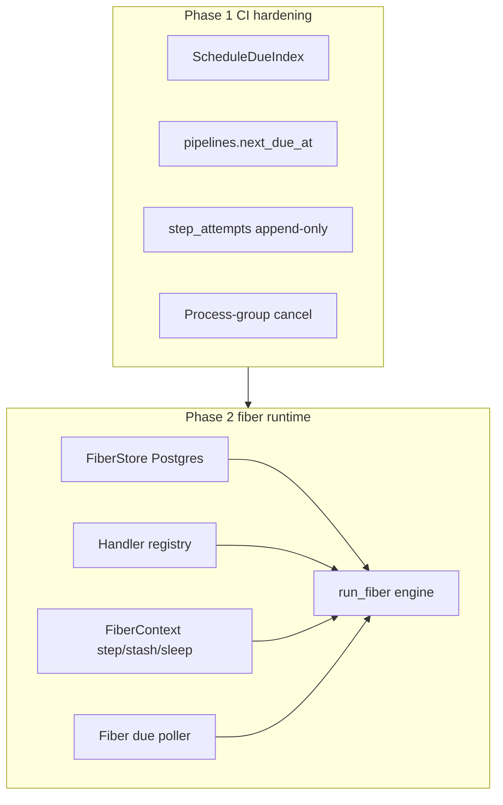

# Port memoturn durable patterns into Fiber (phased)

Reference: `/Users/blake/Sites/projects/memoturn.ai/src/memoturn/durable/` (and docs in `web/apps/docs/.../fibers.md`). Product stays CI-first; Phase 2 adds a real fiber engine without replacing the DAG runner.

## What transfers vs what does not

| Memoturn idea | Phase | How it lands in Fiber |
|---|---|---|
| Due-index + earliest-wake writes | 1 | Pipeline schedule wake cache / `next_due_at` |
| Self-rescheduling wake chain | 1 | On fire, set next `next_due_at = now + interval` (not scan-all + `last_scheduled_at`) |
| Append-only step log | 1 | `step_attempts` history rows for retry/reclaim audit |
| Heartbeat + stale running reclaim | 1 | Already present as leases; tighten agent process-group kill + reclaim events |
| `step` / `stash` / `sleep` / `FiberSuspended` | 2 | New `fiber-durable` crate |
| Named `@durable_task` registry + `run_fiber` | 2 | Handler registry + engine outcomes |
| Per-agent SQLite + DO hibernation | — | **Skip** — Fiber is Postgres multi-tenant; no actor hibernation in v1 |
| HITL interrupts | — | **Defer** — agent/LLM product concern, not CI |

Default for Phase 2 storage: **Postgres** (same DB as CI), not per-entity SQLite.

---

## Phase 1 — CI hardening (ship first)

### 1. Schedule due-index (memoturn `DueIndex` adapted)

Today [`tick_schedules`](crates/fiber-scheduler/src/lib.rs) does `list_all_pipelines()` every 30s and recomputes due from `last_scheduled_at`.

- Add `pipelines.next_due_at TIMESTAMPTZ` (nullable). Backfill from `last_scheduled_at + interval` where interval exists.
- On pipeline create/update when `on.interval_minutes` is set: write `next_due_at = now + interval` (or `now` if never run).
- On successful schedule fire: `next_due_at = now + interval` (self-reschedule, cron-chain spirit without creating a new “fiber” row).
- Scheduler tick: `SELECT … WHERE next_due_at IS NOT NULL AND next_due_at <= NOW()` only.
- Optional in-process `DueIndex` (pipeline_id → earliest due) updated on write path so multi-hot polls stay cheap; seed from DB on API start. Same contract as memoturn: `record` only moves earlier; `set` is authoritative after a sweep.

Touch: [`crates/fiber-core/src/db.rs`](crates/fiber-core/src/db.rs), [`store.rs`](crates/fiber-core/src/store.rs), [`fiber-scheduler/src/lib.rs`](crates/fiber-scheduler/src/lib.rs).

### 2. Append-only step attempt log

Memoturn’s `fiber_steps` idea for CI: each lease/start/retry/complete is an append-only row, not only mutating `step_runs`.

- Table `step_attempts (id, step_run_id, attempt, agent_id, started_at, finished_at, status, exit_code, error)`.
- Write on lease, complete, cancel, reclaim.
- Expose on run API / UI later if cheap; Phase 1 can be store-only + one list endpoint.

### 3. Cancel reliability (small)

Cancel path already signals and `start_kill`s ([`fiber-agent/src/main.rs`](crates/fiber-agent/src/main.rs)). Harden:

- Put host `sh` / docker child in its own process group and kill the group on cancel (grandchildren).
- Keep lease-aware complete ignore (already in store).

### 4. Document durability semantics in README

Short note: CI steps are **at-least-once** after reclaim; steps must be idempotent; schedules use `next_due_at`.

**Phase 1 out of scope:** Redis multi-node event fan-out, S3 artifacts, RBAC, fiber SDK.

---

## Phase 2 — Durable fiber runtime

New workspace crate **`fiber-durable`** (not folded into `fiber-core` DAG code). Naming stays `fiber-*` / `FIBER_*`.

### Crate surface (ported from memoturn)

| Module | Port of | Rust shape |
|---|---|---|
| `status` / `types` | `durable/base.py` | `FiberStatus`, `FiberState { data, sleeps_done }`, `FiberRecord` |
| `context` | `durable/context.py` | `FiberContext::step/stash/get/sleep/sleep_until`; `FiberSuspended` as typed error, not exception soup |
| `engine` | `durable/engine.py` | `run_fiber` → `FiberOutcome::{Completed,Suspended,Failed,Retry}` |
| `store` | `durable/store.py` | Postgres: `fibers` + append-only `fiber_steps`; ready query = pending \| (suspended ∧ wake_at≤now) \| (running ∧ stale heartbeat) |
| `registry` | `durable/registry.py` | `FiberRegistry` + `register("name", handler)`; no global decorator magic |
| `due` | `durable/due_index.py` | Process-local due index keyed by scope (e.g. `project_id`) |
| `scheduler` | `durable/scheduler.py` | Tokio task: seed → poll due → `run_fiber` |

Handlers: `async fn(FiberContext) -> Result<serde_json::Value>`. Step results are `serde_json::Value` (portable checkpointing).

### Integration

- Schema in shared Postgres via [`fiber-core` db init](crates/fiber-core/src/db.rs) or crate-owned migrate helper called from API startup.
- Scope fibers by `project_id` (multi-tenant CI model).
- [`fiber-api`](crates/fiber-api): REST create/list/get/cancel fiber; wire scheduler loop next to existing reclaim/schedule loops.
- Built-in example task: `ping` or self-rescheduling `interval_task` (memoturn `cron_turn` pattern) to prove sleep + resume.
- Unit tests ported in spirit from memoturn `tests/test_fibers.py` / `test_due_index.py` / `test_scheduler.py`: memoized step skip, sleep resume, stale heartbeat reclaim, max attempts, due-index earliest/authoritative.

### Explicit non-goals for Phase 2 v1

- Temporal / pluggable `Durability` backend (document trait stub only).
- Actor hibernation / SQLite snapshots.
- HITL interrupts.
- Replacing DAG CI steps with fibers (CI continues to use `step_runs`; fibers are a parallel primitive for long-running control-plane work).

---

## Suggested order of work

1. Phase 1.1 `next_due_at` + schedule query + backfill
2. Phase 1.2 `step_attempts` writes
3. Phase 1.3 process-group cancel
4. Phase 1.4 README semantics
5. Phase 2 scaffold `fiber-durable` types + store + engine + registry
6. Phase 2 due-index + scheduler loop in API
7. Phase 2 HTTP + one registered demo task + tests

---

## Success criteria

- **Phase 1:** Schedule tick no longer full-scans all pipelines; firing advances `next_due_at`; cancel kills process groups; attempt history exists for a leased step.
- **Phase 2:** A registered handler can `step` → `sleep` → `step`, survive API restart, and complete; due poller wakes it without busy-scanning all fibers every tick.